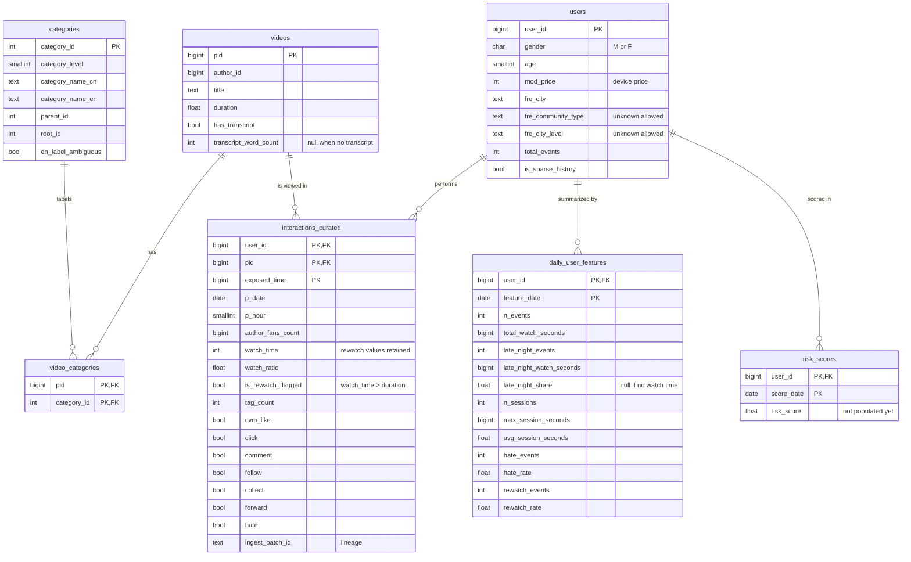

# Entity-Relationship Diagram

**Status:** Implemented in `sql/schema.sql` and loaded successfully on Day 3 (tested against a local
PostgreSQL 16 with the real data). This replaces the Day 1 draft. Two Day 1 design errors were fixed
after inspecting the real data: `mod_price` is a user attribute (it had been placed on `videos`), and the
transcript fields belong to `videos`, not to the per-user daily features.

## Keys and rules

- `interactions_curated` primary key `(user_id, pid, exposed_time)` is the deduplication key from `transformation-spec.md`.
- `unknown` values in `fre_community_type` and `fre_city_level` are stored as text, never as NULL.
- Rewatch-inflated `watch_time` is stored as is, with `is_rewatch_flagged` and `watch_ratio` alongside.
- Load strategy: dimensions are upserted, fact tables are replaced per date partition.
- `risk_scores` is a target table only. The scoring method is not designed.
